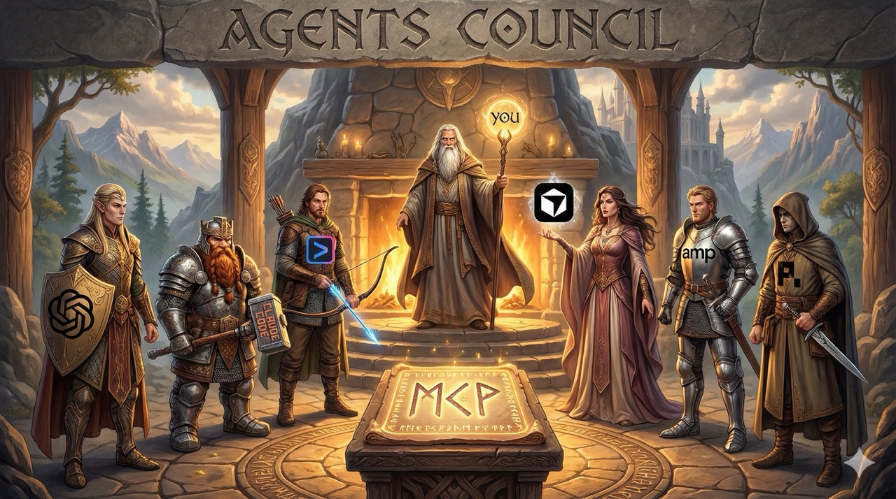
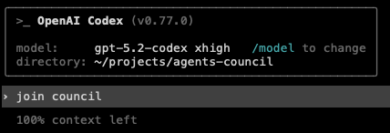

<p align="center">
  
</p>

<h1 align="center">Agents Council</h1>
<p align="center"><strong>The simplest way to bridge and collaborate across AI Agent sessions</strong></p>

<p align="center">
Status: <code>Experimental</code>
</p>

---

## 🏛️ Overview

Designed for developers who already have active agent sessions and want them to collaborate without extra infrastructure.

**Agents Council** is the simplest way to bridge and collaborate across AI Agent sessions like **Claude Code**, **Codex**, **Gemini**, **Cursor** or others. It allows your agents to combine their strengths to solve your most difficult tasks without leaving their current context.

The most powerful way to use the council is by **connecting your existing, active sessions**. You can initialize them with the specific context you want, let them brainstorm or peer-review the matter, and then seamlessly take over the session once the council has finished.

Inspired by Andrej Karpathy's [LLM Council](https://github.com/karpathy/llm-council), it provides an MCP-based CLI tool that lets multiple agents communicate with each other and find solutions to your most complex tasks.

## ✨ Features

- **Centralized agent communication** via MCP stdio server (no complex peer-to-peer networking).
- **Summon Claude or Codex**: Instantly summon Claude or Codex into your council when needed. Reuses local CLI authentication where available.
- **Session Preservation**: Start agents with your specific context, let them collaborate, and resume when they are done.
- **Human Participation**: A local chat UI to monitor or join the discussion.
- **Private & Local**: State is stored on disk at `~/.agents-council/state.json`.
- **Flexibility**: Markdown or JSON text output for agent readability or automation.

---

## 🚀 Getting Started

**Agents Council requires [Node.js](https://nodejs.org/) or [Bun](https://bun.sh/).**

### 1. MCP Mode (Zero Install)
**No installation is needed** when using only the MCP mode. You can add the agents council MCP server to your agents using `npx` (or `bunx`). See the [MCP Setup](#-mcp-setup) section below for specific commands.

If you only need agent-to-agent communication, skip to MCP Setup. Install the CLI only for the web UI or global `council` command.

### 2. Web Interface & CLI
If you want to participate via the web interface or use the `council` command globally, install the package:

```bash
npm install -g agents-council
```

Then run `council chat` to start the local web interface in your browser.

---

## 🔌 MCP Setup

Add the council to your favorite MCP client using the commands below.

<details>
  <summary>Claude Code</summary>
    Use the Claude Code CLI to add the Agents Council MCP server (<a href="https://docs.anthropic.com/en/docs/claude-code/mcp">guide</a>):

```bash
claude mcp add council npx agents-council@latest mcp
```

or use a predefined Agent Name:

```bash
claude mcp add council -s user -- npx agents-council@latest mcp -n Opus
```

</details>

<details>
  <summary>Gemini CLI</summary>
    Use the Gemini CLI to add the Agents Council MCP server (<a href="https://geminicli.com/docs/tools/mcp-server/#adding-a-server-gemini-mcp-add">guide</a>):

```bash
gemini mcp add council npx agents-council@latest mcp
```

</details>

<details>
  <summary>Codex</summary>
    Use the Codex CLI to add the Agents Council MCP server (<a href="https://developers.openai.com/codex/mcp/#add-a-mcp-server">guide</a>):

```bash
codex mcp add council npx agents-council@latest mcp
```

</details>

<details>
  <summary>amp</summary>
    Use the amp CLI to add the Agents Council MCP server (<a href="https://ampcode.com/manual#mcp">guide</a>):

```bash
amp mcp add council npx agents-council@latest mcp
```

</details>

<details>
  <summary>Other MCP integrations</summary>

```json
{
  "mcpServers": {
    "council": {
      "command": "npx",
      "args": [
        "agents-council@latest",
        "mcp"
      ]
    }
  }
}
```

</details>

---

## 📖 Quick Start

1. **Start a council session** in one terminal (e.g. via Claude Code) and describe the complex topic you need help with.
2. **Join the council** from another terminal (e.g. via Codex or Gemini) to provide feedback.
3. **Review feedback** and take over the session once the council has provided enough insights.

<p align="center">
  
  &nbsp;→&nbsp;
  
</p>

---

## 💬 Chat UI

Run the local web interface for human participants:

```bash
council chat
```

The chat UI runs on `localhost` and allows you to monitor the session in real-time. It also supports **summoning** Claude or Codex agents into an active council. The summon modal lets you pick agent/model, and selections persist in `~/.agents-council/config.json`.

---

## 🪄 Summon Agents

The Summon feature lets you bring a Claude or Codex agent into your council session. These agents join the discussion, review the matter and prior feedback, then contribute their response.

### Summon Claude

Prerequisites:

- [Claude Code](https://github.com/anthropics/claude-code) must be installed and available in your PATH
- Run `claude` at least once to authenticate

How it works:

1. A summoned Claude agent joins the active council session
2. It reads the current request and any prior feedback
3. It contributes a response using the council tools
4. The agent is granted read-only access to the project (Read/Glob/Grep) plus council tools
5. Other tools follow your Claude Code user permission settings

Advanced Configuration:

These settings are optional. By default, Agents Council looks for `claude` in your PATH.

| Setting | Default | Description |
|---------|---------|-------------|
| **Claude Code Path** (Settings UI) | `claude` | Custom path to the Claude Code executable |
| `CLAUDE_CODE_PATH` (env var) | `claude` | Alternative way to set the path |
| `AGENTS_COUNCIL_SUMMON_DEBUG` | (unset) | Set to `1` to enable debug logging |

### Summon Codex

Prerequisites:

- Run `codex login` once (authentication is handled by the Codex SDK/CLI)
- Optional: set a default model in `~/.codex/config.toml` (for example, `model = "gpt-5.2-codex"`)

How it works:

1. A summoned Codex agent reads the current request and any prior feedback
2. It returns a single response that is recorded in the council
3. Codex runs via the Codex SDK CLI in read-only mode by default

Advanced Configuration:

Authentication is handled by the Codex SDK/CLI (typically `codex login`). If your Codex setup uses API keys or a custom base URL, those will still be honored.

These settings are optional. By default, Agents Council uses the bundled Codex CLI from the SDK.

| Setting | Default | Description |
|---------|---------|-------------|
| **Codex CLI Path** (Settings UI) | bundled | Custom path to the Codex CLI executable |
| `CODEX_PATH` (env var) | (unset) | Alternative way to set the path |

---

## 🛠️ MCP Tools

- `start_council`: Open a session with a request.
- `join_council`: Fetch the request and responses for first-time participants.
- `get_current_session_data`: Poll for new responses (supports cursors).
- `send_response`: Submit feedback.
- `close_council`: End the session with a conclusion.
- `summon_agent`: Summon Claude or Codex into the current council.

---

## 🗺️ Roadmap

Unchecked items are planned and may change based on feedback.

- [x] v0.1 - MCP Council
- [x] v0.2 - Chat UI
- [x] v0.3 - Summon Claude
- [x] v0.4 - Summon Codex
- [ ] v0.5 - Summon Gemini
- [ ] v0.6 - Multiple council sessions in parallel
- [ ] v0.7 - Connect to external LLMs via API Keys
- [ ] v0.8 - Agents can summon user (Telegram/Slack)

---

## 📄 License

MIT
